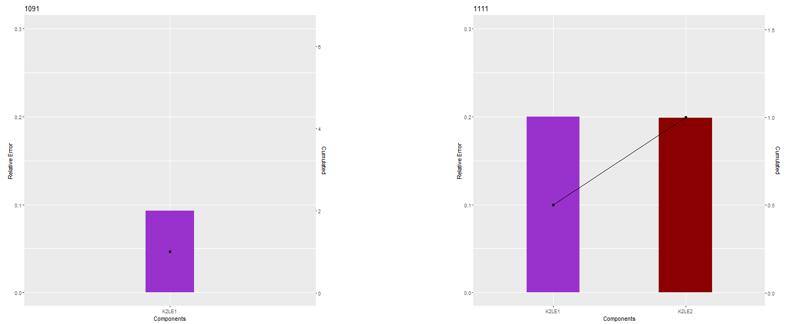
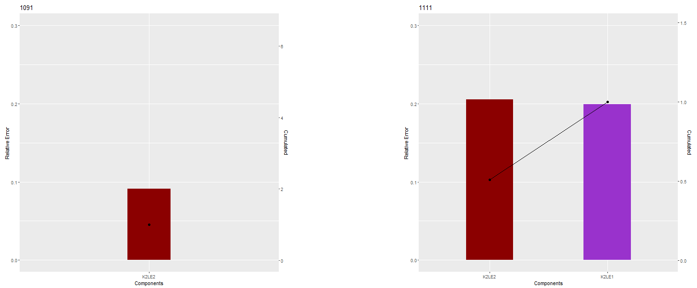
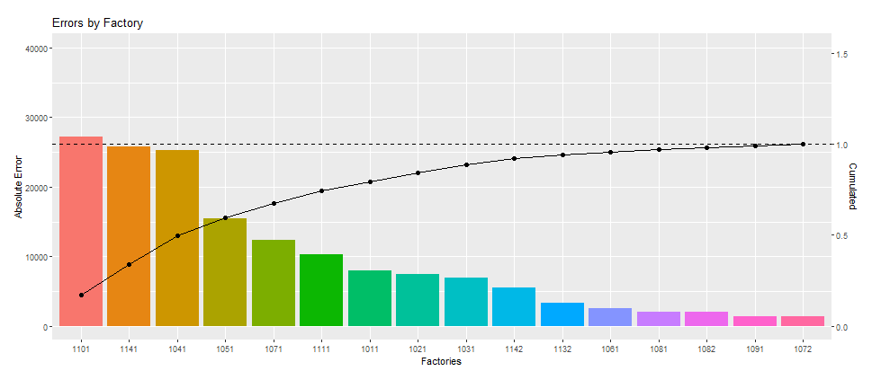
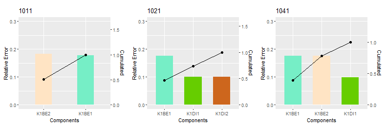
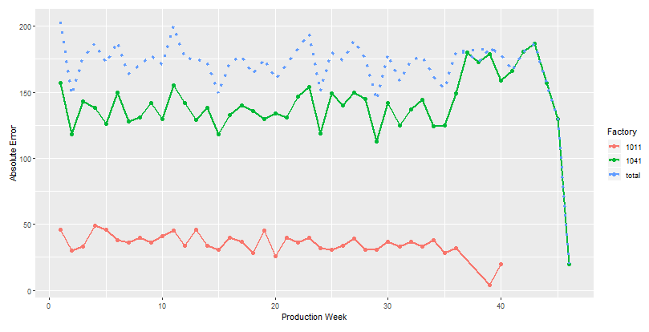
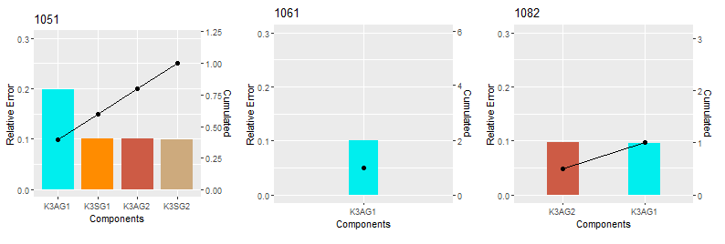

<center>
**Group 04 members:**
</center>
<center> 
Philipp Herpich, Marina Matthaiou, Daniel Schewitz, Tatjana Stefanie Spanehl, Anastasios Tsigkros
</center>

```{r setup, include=FALSE}
knitr::opts_chunk$set(echo = TRUE)

```

## Packages

Preparatory steps: In the beginning we will install the required packages.
We will use the `tidyverse` package.
```{r  results='hide', message=FALSE}


if( !require(tidyverse)){
  install.packages("tidyverse")
}
library(tidyverse)
```

## Import and Tidy
The necessary files are imported using the read.delim function. The data from each file is transformed into a tidy dataset by our function tidy_dataset which is defined before. After that we have clean tables with only the necessary variables as coloumns and all observations as rows. Every file is transformed to a dataset with matching coloumns so they can easily be combined and prepared for plotting.

```{r tidy_dataset, eval=FALSE}

tidy_dataset <- function(component_data) {
  
  # Drop the columns that do not interest us.
  component_data <- select(component_data, -c(
    starts_with("Hersteller"),
    starts_with("Werks"),
    # ends_with("Fahrleistung"),
    starts_with("X")
  ))
  # ID:
  for (id_column in colnames(select(component_data, starts_with("ID")))) {
    component_data[[id_column]] <- as.character(component_data[[id_column]])
  }
  
  # Fehlerhaft
  for (faulty_column in colnames(select(component_data, starts_with("Fehlerhaft")))) {
    if (startsWith(faulty_column, "Fehlerhaft_Datum")) {
      component_data[[faulty_column]] <- as.Date(component_data[[faulty_column]], format = "%Y-%m-%d")
    } else if (startsWith(faulty_column, "Fehlerhaft_Fahrleistung")) {
      component_data[[faulty_column]] <- as.numeric(component_data[[faulty_column]])
    } else {
      component_data[[faulty_column]] <- as.logical(component_data[[faulty_column]])
    }
  }
  # Produktionsatum
  # If the date is set as an origin date:
  if ("origin" %in% colnames(component_data)) {
    for (production_date_column in colnames(select(component_data, starts_with("Produktionsdatum")))) {
      component_data[[paste("Produktionsdatum",
                            ifelse(is.na(strsplit(production_date_column, ".", fixed = TRUE)[[1]][2]),
                                   "", paste(".", strsplit(production_date_column, sep = ".", fixed = TRUE)[[1]][2])
                            ),
                            sep = ""
      )]] <-
        as.Date(component_data[[production_date_column]], origin = "1970-01-01")
    }
  } else {
    for (production_date_column in colnames(select(component_data, starts_with("Produktionsdatum")))) {
      component_data[[production_date_column]] <- as.Date(component_data[[production_date_column]], format = "%Y-%m-%d")
    }
  }
  
  # Create new clean columns
  # These commands are kept separate for readability's sake.
  
  id_cols <- Filter(
    Negate(function(x) is.null(unlist(x))),
    list(
      try(component_data[[colnames(select(component_data, starts_with("ID")))[1]]]),
      try(component_data[[colnames(select(component_data, starts_with("ID")))[2]]]),
      try(component_data[[colnames(select(component_data, starts_with("ID")))[3]]])
    )
  )
  component_data$id <- as.factor(coalesce(!!!id_cols))
  
  production_date_cols <- Filter(
    Negate(function(x) is.null(unlist(x))),
    list(
      try(component_data$Produktionsdatum),
      try(component_data$Produktionsdatum.x),
      try(component_data$Produktionsdatum.y)
    )
  )
  component_data$production_date <- coalesce(!!!production_date_cols)
  
  faulty_date_cols <- Filter(
    Negate(function(x) is.null(unlist(x))),
    list(
      try(component_data$Fehlerhaft_Datum),
      try(component_data$Fehlerhaft_Datum.x),
      try(component_data$Fehlerhaft_Datum.y)
    )
  )
  component_data$faulty_date <- coalesce(!!!faulty_date_cols)
  
  distance_cols <- Filter(
    Negate(function(x) is.null(unlist(x))),
    list(
      try(component_data$Fehlerhaft_Fahrleistung),
      try(component_data$Fehlerhaft_Fahrleistung.x),
      try(component_data$Fehlerhaft_Fahrleistung.y)
    )
  )
  component_data$distance <- coalesce(!!!distance_cols)
  
  faulty_cols <- Filter(
    Negate(function(x) is.null(unlist(x))),
    list(
      try(component_data$Fehlerhaft),
      try(component_data$Fehlerhaft.x),
      try(component_data$Fehlerhaft.y)
    )
  )
  component_data$faulty <- coalesce(!!!faulty_cols)
  
  component_data$production_year <- as.factor(lubridate::year(component_data$production_date))
  component_data$production_week <- lubridate::week(component_data$production_date)
  
  # Fill the producer and factory column using the id data.
  component_data_clean <- component_data %>%
    separate(id, c("id", "producer", "factory", "count"), "-") %>%
    select(c(
      "id", "producer", "factory", "faulty",
      "production_year", "production_week", "faulty_date"
    ))
  rm(component_data)
  
  component_data_clean$id <- as.factor(component_data_clean$id)
  component_data_clean$producer <- as.numeric(component_data_clean$producer)
  component_data_clean$factory <- as.numeric(component_data_clean$factory)
  component_data_clean
}

```

The data of every component file is stored in a seperate tibble.

```{r import, eval=FALSE}

component_tibbles <- vector(mode = "list", length = 16)
names(component_tibbles) <- c(
  "K1BE1", "K1BE2", "K1DI1", "K1DI2",
  "K2LE1", "K2LE2", "K2ST1", "K2ST2",
  "K3AG1", "K3AG2", "K3SG1", "K3SG2",
  "K4", "K5", "K6", "K7")

#read data using read.delim and the separators 
#K1
component_tibbles$K1BE1 <-  tidy_dataset(read.delim(paste("Data/Komponente/Komponente_K1BE1.csv",sep = ""), head = TRUE, ","))
component_tibbles$K1BE2 <-  tidy_dataset(read.delim(paste("Data/Komponente/Komponente_K1BE2.csv",sep = ""), head = TRUE, ";"))
component_tibbles$K1DI1 <-  tidy_dataset(read.delim(paste("Data/Komponente/Komponente_K1DI1.csv",sep = ""), head = TRUE, ","))

#K1di2 
component_tibbles$K1DI2 <- readChar('Data/Komponente/Komponente_K1DI2.txt', file.info('Data/Komponente/Komponente_K1DI2.txt')$size)
component_tibbles$K1DI2 <- gsub('[[:blank:]]', '\\', component_tibbles$K1DI2)
component_tibbles$K1DI2 <- gsub('""', '"\n"', component_tibbles$K1DI2)
component_tibbles$K1DI2 <- tidy_dataset(read.delim(text = component_tibbles$K1DI2, header = TRUE , sep = '\\'))

#K2
component_tibbles$K2LE2 <-  tidy_dataset(read.delim(paste("Data/Komponente/Komponente_K2LE2.txt",sep = ""), header = TRUE, "\\"))
component_tibbles$K2ST1 <-  tidy_dataset(read.delim(paste("Data/Komponente/Komponente_K2ST1.txt",sep = ""), header = TRUE, "|"))
component_tibbles$K2ST2 <-  tidy_dataset(read.delim(paste("Data/Komponente/Komponente_K2ST2.csv",sep = ""), header = TRUE, ";"))

#K2le1
component_tibbles$K2LE1 <- readChar('Data/Komponente/Komponente_K2LE1.txt', file.info('Data/Komponente/Komponente_K2LE1.txt')$size)
component_tibbles$K2LE1 <- gsub('\x0B"', '\n"', component_tibbles$K2LE1)
component_tibbles$K2LE1 <- gsub('II', ' ', component_tibbles$K2LE1)
component_tibbles$K2LE1 <- tidy_dataset(read.delim(text = component_tibbles$K2LE1, header = TRUE , sep = ' '))

#K3
component_tibbles$K3AG1 <-  tidy_dataset(read.delim(paste("Data/Komponente/Komponente_K3AG1.csv",sep = ""), header = TRUE, ","))
component_tibbles$K3AG2 <-  tidy_dataset(read.delim(paste("Data/Komponente/Komponente_K3AG2.txt", sep = ""), header = TRUE, "\\"))
component_tibbles$K3SG1 <-  tidy_dataset(read.delim(paste("Data/Komponente/Komponente_K3SG1.csv",sep = ""), header = TRUE, ","))
component_tibbles$K3SG2 <-  tidy_dataset(read.delim(paste("Data/Komponente/Komponente_K3SG2.csv",sep = ""), header = TRUE, ","))

#K4 -k7
component_tibbles$K4 <-  tidy_dataset(read.delim(paste("Data/Komponente/Komponente_K4.csv", sep = ""), header = TRUE, ";"))
component_tibbles$K5 <-  tidy_dataset(read.delim(paste("Data/Komponente/Komponente_K5.csv", sep = ""), header = TRUE, ","))
component_tibbles$K6 <-  tidy_dataset(read.delim(paste("Data/Komponente/Komponente_K6.csv", sep = ""), header = TRUE, ";"))
component_tibbles$K7 <-  tidy_dataset(read.delim(paste("Data/Komponente/Komponente_K7.txt", sep = ""), header = TRUE, "\t"))


```

The data is transformed into three different dataframes for the three plotting tasks.

```{r prepare, eval=FALSE}

#dataframes for app
errors_by_id <- component_tibbles
for (component in 1:length(errors_by_id)){
  errors_by_id[[component]] <- errors_by_id[[component]] %>%
    group_by(id, producer, factory, production_year) %>%
    summarise(abs_error = sum(faulty, na.rm = TRUE), rel_error = abs_error/length(id))
}
errors_by_id <- bind_rows(errors_by_id)

errors_by_factory <- bind_rows(component_tibbles) %>%
  group_by(factory, production_year) %>%
  summarise(abs_error = sum(faulty, na.rm = TRUE), rel_error = abs_error/length(id))

errors_by_id_week <- component_tibbles
for (component in 1:length(errors_by_id_week)){
  errors_by_id_week[[component]] <- errors_by_id_week[[component]] %>%
    group_by(factory, production_year, production_week) %>%
    summarise(abs_error = sum(faulty, na.rm = TRUE), rel_error = abs_error/length(id)) %>%
    group_by(production_year, production_week) %>%
    mutate(total_error = sum(abs_error))
}

save(errors_by_factory, errors_by_id, errors_by_id_week, file = "dataset_app.RData")


```

These steps result in our final dataset and we can start our analysis.

## Analysis  
In the following we look at the visualisation of our dataset to decide, where the next inspection should be carried out. Therefore we will especially focus on the most recent data and on the relative error figures because they are more meaningfull than the absolute error figures for evaluating the quality of a production process. The used graphs are from 2016 if not stated otherwise. These can be taken as exemplary for all years, because the data has very little deviation between the different years.

**Option 1**  
Overall the highest error rate of all factories occurs at factory 1111 with approximately 20% error rate. 


This factory produces the components K2LE1 and K2LE2. The component K2LE1 was produced at the factory 1091 until the year 2012 with less than half the error rate.



After the year 2012 the factory 1091 has been producing the component K2LE2 again with less than 10% error rate.



This means that the production process of factory 1111 needs to be optimised, because the high error rate is not dependent on the product but on the factory.

**Option 2**  
Factory 1041 has the third highest error rate with 15%.  It is very relevant for the overall production volume because it also has the third highest absolute error count. In year 2016 it produced 25000 faulty components which is significantly more than the 10000 of factory 1111.



The factory produces the components K1BE1, K1BE2 and K1D1. 
The error rates for these components are similar in all producing factories. 



On the graphs of both components you can see that the absolute errors are fairly constant over the year and the factory 1041 is the most relevant factory in this regard.




However the relative error rates of K1BE1 and K1BE2 are very high in every factory compared to other components which indicates that an inspection of these product groups seems to be necessary regardless of the factories producing it.

**Option 3**  
Another component which stands out is the component K3AG1 with an error rate of 20% at the factory 1051 and only about 10% percent at the two other factories 1061 and 1082. This indicates to inspect the production line for this component at the factory 1051.



**Conclusion**  
In conclusion we found three different opportunities for optimisation. The biggest potential for lowering the overall error rates we see at the factory 1111, so we would decide to carry out the next inspection there and do a comprehensive process inspection.


